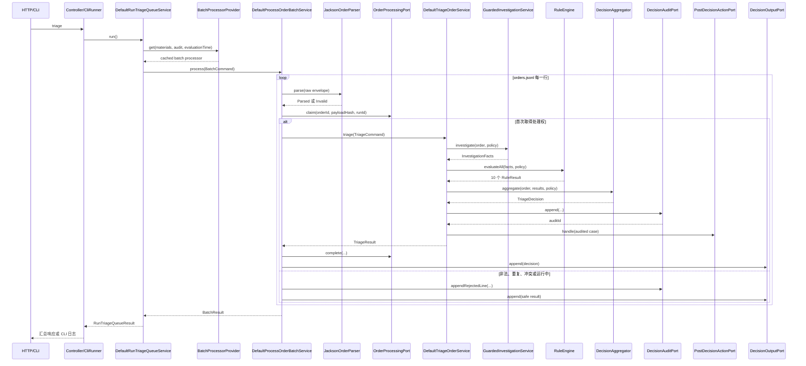
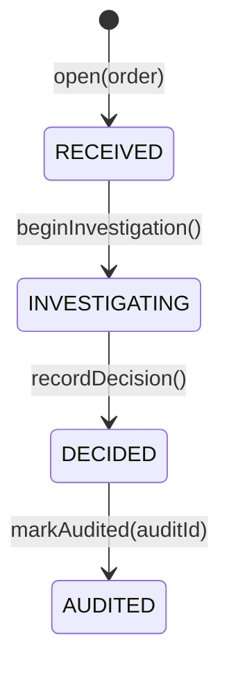

# Asset 项目代码走读指导

## 1. 这份文档解决什么问题

这份文档用于从入口开始，完整走读“读取订单队列、逐单调查、执行规则、生成决定、写审计和输出评测”的主流程。

走读时先记住一句话：

> Web 和 CLI 只是两种入口；真正的业务主链从 `RunTriageQueueUseCase` 开始，最终决定由确定性领域规则产生，Agent 只能补查事实，不能直接决定资金动作。

建议不要一开始逐个阅读全部 144 个 Java 文件。先按照本文给出的顺序掌握主干，再根据具体规则进入支线。

## 2. 先建立整体心智模型

项目采用 DDD 分层和端口适配器结构：

```text
adapter
  接收 HTTP 或 CLI 输入，转换成应用调用

application
  编排批处理、单笔分诊、事实调查、审计和后置动作

domain
  表达订单、案件生命周期、规则结果、最终决定和业务不变量

infrastructure
  读取文件、写 JSONL、实现幂等、调用 Agent、提供 Stub 和组装运行时
```

核心依赖方向是：

```text
Adapter -> Application -> Domain
               ^
               |
        Infrastructure 实现 Application 定义的 Port
```

Domain 层不依赖 Spring、Jackson 或文件系统。

## 3. 推荐阅读顺序

### 3.1 第一轮：30 分钟看懂骨架

按以下顺序阅读，每个文件先只看字段、构造方法和主方法：

1. `src/main/java/com/jason/yang/AssetApplication.java`
2. `src/main/java/com/jason/yang/asset/infrastructure/config/TriageApplicationConfiguration.java`
3. `src/main/java/com/jason/yang/asset/adapter/web/TriageController.java`
4. `src/main/java/com/jason/yang/asset/application/batch/RunTriageQueueUseCase.java`
5. `src/main/java/com/jason/yang/asset/application/service/DefaultRunTriageQueueService.java`
6. `src/main/java/com/jason/yang/asset/infrastructure/config/OfflineTriageRuntimeFactory.java`
7. `src/main/java/com/jason/yang/asset/application/service/DefaultProcessOrderBatchService.java`
8. `src/main/java/com/jason/yang/asset/application/service/DefaultTriageOrderService.java`
9. `src/main/java/com/jason/yang/asset/application/service/DefaultInvestigationService.java`
10. `src/main/java/com/jason/yang/asset/domain/policy/CoreRules.java`
11. `src/main/java/com/jason/yang/asset/domain/service/DefaultDecisionAggregator.java`
12. `src/main/java/com/jason/yang/asset/domain/TriageCase.java`

第一轮结束后，你应该能回答：入口在哪里、谁循环订单、谁查事实、谁执行规则、谁产生决定、谁写审计。

### 3.2 第二轮：60 分钟理解安全性

继续阅读：

1. `InMemoryOrderProcessingAdapter`：订单级幂等。
2. `InMemoryFundsEventRegistryAdapter`：资金事件级去重。
3. `GuardedInvestigationService`：何时进入 Agent。
4. `LlmAgentInvestigationAdapter`：Agent 循环、工具白名单和停止条件。
5. `AgentExecutionPolicy`、`AgentBatchBudget`：单单和整批预算。
6. `JsonLinesDecisionAuditAdapter`：审计记录包含什么。
7. `DefaultPostDecisionActionService`：审计之后允许做什么。
8. `JsonGoldenEvaluationService`：如何证明 14 单结果正确。

## 4. 启动和 Bean 装配

### 4.1 Spring Boot 入口

`AssetApplication.main()` 调用 `SpringApplication.run()`，触发组件扫描和自动配置。

`TriageController` 使用 `@RestController` 注册。它只有一个构造方法，因此 Spring 自动执行构造器注入，不需要额外添加 `@Autowired`。

### 4.2 组合根

`TriageApplicationConfiguration` 是共享组合根，负责创建以下 Bean：

| Bean 接口或类型 | 实际实现 | 用途 |
|---|---|---|
| `OfflineTriageRuntimeFactory` | 自身 | 组装完整离线运行时 |
| `BatchProcessorProvider` | `CachingOfflineBatchProcessorProvider` | 按运行配置缓存批处理器 |
| `RunTriageQueueUseCase` | `DefaultRunTriageQueueService` | Web/CLI 共享的队列入口 |
| `EvaluateTriageUseCase` | `JsonGoldenEvaluationService` | 黄金用例评测入口 |

`DefaultRunTriageQueueService` 没有 `@Service`，因为它已经由配置类中的 `@Bean` 方法注册。这使应用服务保持为普通 Java 类。

### 4.3 Web 和 CLI 如何共用主流程

Web 入口：

```text
POST /api/v1/test/triage
  -> TriageController.triage()
  -> runTriageQueueUseCase.run()
```

CLI 入口：

```text
TriageCliRunner.triage()
  -> runTriageQueueUseCase.run()
```

两种入口调用的是同一个无参方法：

```java
RunTriageQueueResult execution = runTriageQueueUseCase.run();
```

Controller 只额外负责 requestId、HTTP 日志和响应 DTO；CLI 只负责命令解析和终端日志。

## 5. 主流程总图



## 6. 队列级入口：DefaultRunTriageQueueService

文件：`src/main/java/com/jason/yang/asset/application/service/DefaultRunTriageQueueService.java`

`run()` 做六件事：

1. 生成本次运行的 `runId`。
2. 使用 Service 内的固定路径：
   - `materials/`
   - `materials/orders.jsonl`
   - `build/decisions.jsonl`
   - `build/audit.jsonl`
3. 固定评估时刻为 `2026-07-28T12:00:00Z`，保证离线结果可重现。
4. 通过 `ReentrantLock` 串行化整批执行，避免两个请求覆盖同一个输出文件。
5. 从 `BatchProcessorProvider` 获取批处理器。
6. 构造内部 `BatchCommand` 并调用 `process()`。

这里的锁是队列执行边界，不是单笔订单的业务锁。

### Runtime 为什么要缓存

`CachingOfflineBatchProcessorProvider` 使用以下三项作为 key：

```text
materialsDirectory + auditFile + evaluationTime
```

相同配置会复用同一个离线 Runtime，因此以下内存状态能够跨 Web 请求保留：

- 订单处理幂等状态。
- 资金事件去重状态。
- 案件仓储状态。
- Agent 批次预算和熔断状态。

当前路径和时刻固定，因此正常 Web 调用只会创建一次 Runtime。

## 7. Runtime 装配：OfflineTriageRuntimeFactory

这个类是理解依赖关系最重要的文件之一。它没有业务判断，但把整条链连接起来。

可以按五组对象阅读：

### 7.1 权威事实适配器

- `FileCustomerProfileAdapter`：读取 `customers.json`。
- `FileAssetPolicyAdapter`：读取 `assets.json`。
- `FileAddressRiskAdapter`：读取 `address_risk.json`。
- `FileReferenceRateAdapter`：读取 `reference_rates.json`。
- `EmbeddedFiatReceiptStubAdapter`：模拟法币到账查询。
- `EmbeddedBlockchainDepositStubAdapter`：模拟链上充值查询。
- `UnavailableWalletFundsAdapter`：演示钱包事实不可用。
- `LocalTravelRuleAdapter`：本地 Travel Rule 评估。

Factory 会在创建 Runtime 前验证四个材料 JSON 文件存在且可读。

### 7.2 确定性调查器

`DefaultInvestigationService` 依赖上述端口，只收集事实，不产生决定。

### 7.3 受限 Agent

`GuardedInvestigationService` 包装确定性调查器。只有出现 `Unavailable` 或 `Conflict` 事实时，才调用 `LlmAgentInvestigationAdapter` 补查。

### 7.4 单笔决策器

`DefaultTriageOrderService` 组合：

- 策略提供器。
- 调查端口。
- 规则引擎。
- 决定聚合器。
- 人类可读解释器。
- 审计端口。
- 案件仓储。
- 领域事件发布器。
- 审计后动作处理器。
- Agent 轨迹端口。

### 7.5 批处理器

`DefaultProcessOrderBatchService` 组合 Parser、单笔 Use Case、幂等端口、结果输出端口和批次审计端口。

## 8. 批处理：DefaultProcessOrderBatchService

### 8.1 process()

`process(BatchCommand)` 首先调用 `outputPort.initialize()`。这会清空并重新创建 `build/decisions.jsonl`；审计文件不会清空，而是追加写入。

随后使用 `BufferedReader` 逐行读取 JSONL。当前实现虽然保留 `maxConcurrency` 字段，但实际仍是单线程顺序处理。

每行异常都被局部捕获，整批不会因为一单失败而停止。异常单优先写入：

```text
MANUAL_REVIEW + INTERNAL_PROCESSING_ERROR
```

如果连审计也失败，则输出中再增加 `AUDIT_PERSISTENCE_FAILED`，并且不会执行资金动作。

### 8.2 processLine()

这一方法是批处理的核心分叉点：

1. 对原始行计算 SHA-256。
2. 构造 `RawOrderEnvelope`，保存来源位置和 payload hash。
3. 调用 `JacksonOrderParser.parse()`。
4. 非法输入直接输出 `INVALID_INPUT`，不会进入正常规则链。
5. 合法输入调用 `processingPort.claim()` 做订单级幂等判断。

### 8.3 订单级幂等的四种结果

| Claim 状态 | 含义 | 行为 |
|---|---|---|
| `ACQUIRED` | 首次处理 | 进入单笔分诊主流程 |
| `ALREADY_COMPLETED_SAME_PAYLOAD` | 同 orderId、同 payload 已完成 | 复用原决定并标记 replayed |
| `ALREADY_RUNNING` | 同一订单正在处理 | `HOLD` |
| `PAYLOAD_CONFLICT` | 同 orderId 但 payload 不同 | `MANUAL_REVIEW` |

注意这里判断的不是“订单是否存在”，而是“相同订单和原始 payload 是否已经安全处理”。

### 8.4 processAcquired()

它构造 `TriageCommand` 进入单笔 Use Case。成功后按以下顺序处理：

```text
triage -> complete 幂等状态 -> 写结果文件
```

发生异常时调用 `processingPort.fail()` 释放 claim，使后续可以安全重试。

## 9. 输入解析：JacksonOrderParser

Parser 把不可信 JSON 转换为领域订单，目前支持：

- `on_ramp` -> `OnRampOrder`
- `off_ramp` -> `OffRampOrder`
- `withdrawal` -> `WithdrawalOrder`

它负责字段存在性、金额正数、整数范围、时间格式、嵌套对象和订单类型校验。校验错误返回 `OrderParseResult.Invalid`，而不是让不完整对象进入 Domain。

`customer_note` 不参与任何决定。订单中的自然语言不能覆盖规则、风险事实或资金状态，这是防 Prompt Injection 的关键点。

## 10. 单笔分诊：DefaultTriageOrderService

`triage()` 是最值得逐行阅读的方法。其顺序不能随意调整：

```text
打开 TriageCase
  -> beginInvestigation
  -> 获取 PolicySnapshot
  -> 调查 InvestigationFacts
  -> 执行全部规则
  -> 聚合 TriageDecision
  -> recordDecision
  -> 保存 DECIDED 案件
  -> 生成人类可读解释
  -> 写入审计
  -> markAudited
  -> 保存 AUDITED 案件
  -> 发布领域事件
  -> 执行审计后动作
  -> 返回 TriageResult
```

最重要的安全边界是：

> 审计写入成功并得到 auditId 之后，案件才能变为 AUDITED，随后才允许调用后置动作。

审计失败会抛出异常，后置动作不会执行。

## 11. TriageCase 聚合根

案件生命周期为：



聚合根保证：

- 只能从 `RECEIVED` 开始调查。
- 只有调查中才能记录决定。
- 决定必须属于同一个 orderId。
- 只有已经决定的案件才能关联审计。
- `auditId` 不能为空。
- 只有 `AUDITED + AUTO_COMPLETE + fundsMovementAllowed` 才具备资金动作资格。

这部分是 DDD 中“把不变量放进聚合根”的直接体现。

## 12. 事实调查：DefaultInvestigationService

调查器统一产生 `InvestigationFacts`，包含七类查询结果：

| 事实 | Port | 用途 |
|---|---|---|
| customer | `CustomerProfilePort` | 客户状态、额度、已验证户名 |
| assetPolicy | `AssetPolicyPort` | 币种网络、最小金额、确认数 |
| addressRisk | `AddressRiskPort` | 制裁、混币器、风险分数 |
| funding | 不同资金 Port | 法币到账、链上充值或钱包预留 |
| referenceRate | `ReferenceRatePort` | 过期报价和提现美元估值 |
| travelRule | `TravelRulePort` | VASP 和 Travel Rule 信息完整性 |
| duplicate | `FundsEventRegistryPort` | 链上资金事件是否重复入账 |

`LookupResult` 不只是“有或没有”，而是区分：

- `Found`：查询成功且有事实。
- `NotFound`：权威系统明确表示不存在。
- `Unavailable`：工具不可用或暂时无法查询。
- `Conflict`：多个权威事实冲突。
- `NotApplicable`：该订单不需要此事实。

这种区分很重要：`NotFound` 可以触发明确业务规则，而 `Unavailable/Conflict` 必须停止自动处理或尝试受限补查。

### 不同订单类型的资金事实

```text
OnRampOrder    -> FiatReceiptPort
OffRampOrder   -> BlockchainDepositPort
WithdrawalOrder -> WalletFundsPort
```

OffRamp 还会执行资金事件去重。参考汇率只在报价过期或提现估值需要时查询。

## 13. Agent 什么时候参与

入口在 `GuardedInvestigationService.investigate()`：

```text
先执行确定性调查
  -> 所有事实已解决：直接返回
  -> 存在 Unavailable/Conflict：调用 AgentEnrichmentPort
```

`NotFound` 不会触发 Agent，因为它已经是一个明确的权威结果。

### 13.1 Agent 的权限

`LlmAgentInvestigationAdapter` 允许模型做的是：

- 查看缺少哪些事实类型。
- 从当前符合前置条件的白名单工具中选择一个。
- 请求执行该工具。

模型不能做的是：

- 返回最终 `Disposition`。
- 修改规则优先级。
- 绕过审计。
- 调用未注册工具。
- 重复调用已经完成的工具。
- 直接执行资金动作。

工具的真实执行仍由 `PortBackedAgentToolbox` 调用已有权威 Port 完成。

### 13.2 单笔停止条件

默认单笔限制位于 `AgentExecutionPolicy.demoDefaults()`：

| 限制 | 默认值 |
|---|---:|
| 最大迭代 | 8 |
| 最大工具调用 | 7 |
| 最大 Token | 8,000 |
| 总超时 | 30 秒 |
| 最大重试 | 2 |
| 初始退避 | 200 ms，指数退避并带抖动 |

还会在以下情况下立即停止：工具不在白名单、重复工具、响应无效、事实仍不完整、没有可用工具、Token 报告异常或线程中断。

停止后不会让模型猜测事实，而是保留 `Unavailable/Conflict`。随后 `FactAvailabilityRule` 产生 `HOLD` 或 `MANUAL_REVIEW`，即 fail-closed。

### 13.3 整批保护

`AgentBatchBudget.demoDefaults()` 提供跨订单限制：

| 限制 | 默认值 |
|---|---:|
| 整批模型调用 | 2,000 |
| 整批 Token | 2,000,000 |
| Agent 并发会话 | 4 |
| 连续失败熔断阈值 | 5 |

Agent 运行轨迹最终会进入审计，包括 provider、model、prompt version、迭代数、模型调用数、工具调用数、重试数、Token、耗时、停止原因和工具摘要。

## 14. 确定性规则

规则注册入口是 `CoreRules.standard()`，当前固定执行 10 条规则：

| 规则 | 主要判断 | 典型结果 |
|---|---|---|
| `FactAvailabilityRule` | 权威事实冲突或工具不可用 | `MANUAL_REVIEW` / `HOLD` |
| `AddressRiskRule` | 制裁、高风险、混币器、未知地址 | `FREEZE_COMPLIANCE` / `HOLD` |
| `CustomerRule` | 客户存在、状态和额度 | `MANUAL_REVIEW` / `REJECT_ESCALATE` / `HOLD` |
| `AssetNetworkRule` | 币种网络、实际入账网络、最小金额 | `OPS_RECOVERY` / `MANUAL_REVIEW` |
| `FundingRule` | 法币到账、链上确认数、钱包预留 | `HOLD` |
| `AmountMatchRule` | 到账或预留金额是否匹配 | `MANUAL_REVIEW` |
| `QuoteRule` | 报价是否过期以及滑点 | `HOLD` / `REQUOTE` |
| `BankAccountRule` | OffRamp 收款户名是否匹配 | `REJECT_ESCALATE` |
| `TravelRule` | VASP 状态和必要信息是否完整 | `HOLD` |
| `DuplicateFundsEventRule` | 同一链上事件是否已入账 | `DUPLICATE_NOOP` / `HOLD` / `MANUAL_REVIEW` |

`DefaultRuleEngine` 会执行全部规则，不会在第一条失败后提前停止。这样审计能保存完整的规则结果和全部 reason code。

修改业务规则时优先修改或新增 `domain/policy` 下的纯 Java 规则，然后在 `CoreRules.standard()` 注册。不要把规则写进 Controller、Prompt 或 LLM Provider。

## 15. 最终决定如何聚合

`DefaultDecisionAggregator` 从 `AUTO_COMPLETE` 开始，遍历全部失败规则，选择优先级最高的 `Disposition`，同时去重并保留 reason codes。

当前优先级从高到低为：

```text
FREEZE_COMPLIANCE
INVALID_INPUT
REJECT_ESCALATE
HOLD
DUPLICATE_NOOP
OPS_RECOVERY
MANUAL_REVIEW
REFUND_REVIEW
REQUOTE
AUTO_COMPLETE
```

只有没有任何规则失败时才得到：

```text
AUTO_COMPLETE + ALL_CHECKS_PASSED + fundsMovementAllowed=true
```

任何其他结果的 `fundsMovementAllowed` 都是 false。LLM 的输出不会传给聚合器作为决定。

## 16. 审计、解释和后置动作

### 16.1 人类可读解释

`TemplateDecisionExplanationService` 根据最终决定和规则结果生成说明。它负责“人能看懂”，但不是决定来源。

### 16.2 审计记录

`JsonLinesDecisionAuditAdapter` 追加写入 `build/audit.jsonl`，包含：

- auditId、runId、sourcePosition、payload SHA-256。
- orderId、customerId、资产和网络。
- policy version。
- 七类事实的状态摘要。
- 每条规则的 passed、proposed disposition、reason code 和 detail。
- 最终决定和解释。
- 如果使用 Agent，则包含 Agent 运行轨迹。

原始订单 payload、客户备注和敏感密钥不会直接写进审计。

### 16.3 后置动作

`DefaultPostDecisionActionService` 只接受 `AUDITED` 案件：

- 风险或异常结果可以创建合规、运维或人工工单。
- 资金动作必须同时满足聚合根资格和执行模式要求。
- 当前 Factory 使用 `ExecutionMode.DECISION_ONLY`，不会执行真实或模拟资金移动。
- 当前工单和执行 Gateway 都是 Recording Adapter，不连接外部生产系统。

## 17. 两种幂等不要混淆

### 17.1 订单处理幂等

实现：`InMemoryOrderProcessingAdapter`

Key 是 `orderId`，同时比较 payload SHA-256。它防止相同订单重复跑完整流程，以及相同 orderId 被不同内容覆盖。

### 17.2 资金事件幂等

实现：`InMemoryFundsEventRegistryAdapter`

Key 是 OffRamp 链上充值事件，例如网络和 tx hash 形成的 event key。它防止两个不同订单重复认领同一笔链上充值。

O-002 和 O-013 是最直观的例子：两个 orderId 不同，因此订单处理 claim 都能成功；但它们使用同一资金事件，O-013 最终得到 `DUPLICATE_NOOP`。

两个适配器目前都是进程内存实现。服务重启后状态丢失，生产实现应替换成数据库或带唯一约束的持久化存储。

## 18. 评测流程

Web 入口：

```text
POST /api/v1/test/evaluate
```

CLI 入口：

```text
evaluate --materials materials --golden evaluation/golden-cases.json --report build/evaluation-report.json
```

`JsonGoldenEvaluationService.evaluate()` 会：

1. 创建临时工作目录。
2. 创建一个隔离的离线 Runtime。
3. 重新处理 `materials/orders.jsonl`。
4. 读取实际 decisions JSONL。
5. 与 `evaluation/golden-cases.json` 比较。
6. 校验 disposition 和 required reason codes。
7. 单独统计不安全的 `AUTO_COMPLETE`。
8. 写入 `build/evaluation-report.json`。

最重要的成功指标是：

```text
failed = 0
unsafeAutoCompletions = 0
```

评测使用结构化字段，不比较自然语言解释，因此文案变化不会造成无意义失败。

## 19. 三个推荐的实际跟踪样例

### 19.1 O-001：正常自动完成

预期结果：`AUTO_COMPLETE`。

跟踪重点：

1. Parser 生成 `OnRampOrder`。
2. 法币到账 Stub 返回确认。
3. 所有规则通过。
4. 聚合器加入 `ALL_CHECKS_PASSED`。
5. 审计成功后 `fundsMovementEligible()` 为 true。
6. 因模式是 `DECISION_ONLY`，仍不会执行资金动作。

### 19.2 O-011：事实不可用并进入 Agent

预期结果：`HOLD`，原因包含 `TOOL_UNAVAILABLE` 和 `TRAVEL_RULE_INFO_MISSING`。

跟踪重点：

1. `WithdrawalOrder` 需要钱包余额/预留资金和参考汇率。
2. `UnavailableWalletFundsAdapter` 返回不可用。
3. `GuardedInvestigationService` 发现 unresolved facts。
4. 默认 Stub Agent 只能尝试白名单工具，无法凭空补出钱包事实。
5. Agent 停止原因进入轨迹。
6. `FactAvailabilityRule` 将结果安全降级为 `HOLD`。

### 19.3 O-013：不同订单引用同一资金事件

预期结果：`DUPLICATE_NOOP`。

跟踪重点：

1. O-002 先认领 tx hash `0xa1`。
2. O-013 的 orderId 不同，订单级 claim 正常获得。
3. `InMemoryFundsEventRegistryAdapter` 发现资金 event key 已属于 O-002。
4. `DuplicateFundsEventRule` 输出 `DUPLICATE_TX_HASH`。
5. 聚合器选择 `DUPLICATE_NOOP`，禁止再次入账。

## 20. IDEA 断点建议

第一次调试 `/triage` 时按顺序设置断点：

1. `TriageController.triage()`
2. `DefaultRunTriageQueueService.run()`
3. `CachingOfflineBatchProcessorProvider.get()`
4. `DefaultProcessOrderBatchService.processLine()`
5. `JacksonOrderParser.parse()`
6. `InMemoryOrderProcessingAdapter.claim()`
7. `DefaultTriageOrderService.triage()`
8. `DefaultInvestigationService.investigate()`
9. `GuardedInvestigationService.investigate()`
10. `DefaultRuleEngine.evaluateAll()`
11. 某个具体 `TriageRule.evaluate()`
12. `DefaultDecisionAggregator.aggregate()`
13. `JsonLinesDecisionAuditAdapter.append()`
14. `TriageCase.markAudited()`
15. `DefaultPostDecisionActionService.handle()`
16. `JsonLinesDecisionOutputAdapter.append()`

如果只想跟踪 O-011，可以在 `processLine()` 添加条件断点：

```java
line.contains("\"order_id\":\"O-011\"")
```

观察变量时重点看：

- `parseResult`
- `claim.status()`
- `facts` 中每个 `LookupResult` 的实际子类型
- `ruleResults`
- `decision.disposition()` 和 `decision.reasonCodes()`
- `triageCase.status()`
- `auditId`
- Agent 的 `stopReason`

## 21. 本地运行与验证

### 21.1 构建和全部测试

```powershell
mvn clean package
```

需要 JDK 21 和 Maven 3.9+。

### 21.2 启动 Web 服务

可以直接在 IDEA 中运行 `AssetApplication.main()`，也可以执行：

```powershell
java -jar target/asset-0.0.1-SNAPSHOT.jar
```

调用主流程：

```powershell
curl.exe -X POST `
  -H "X-Request-Id: walkthrough-001" `
  http://localhost:8080/api/v1/test/triage
```

调用评测：

```powershell
curl.exe -X POST `
  -H "X-Request-Id: evaluation-001" `
  http://localhost:8080/api/v1/test/evaluate
```

### 21.3 运行 CLI 主流程

```powershell
java -Dspring.profiles.active=cli `
  -jar target/asset-0.0.1-SNAPSHOT.jar `
  triage
```

CLI profile 通过 `application-cli.yml` 设置：

```yaml
spring:
  main:
    web-application-type: none
```

因此 CLI 执行结束后退出，不监听 8080。

### 21.4 查看结果

```powershell
Get-Content build/decisions.jsonl
Get-Content build/audit.jsonl
Get-Content build/evaluation-report.json
```

## 22. 测试如何对应主流程

| 测试 | 覆盖目标 |
|---|---|
| `JacksonOrderParserTest` | 输入解析和不可信字段 |
| `DefaultRunTriageQueueServiceTest` | 共享队列入口和固定配置映射 |
| `CoreDecisionServiceTest` | 规则和决定核心行为 |
| `TriageCaseTest` | 聚合生命周期与不变量 |
| `CachingOfflineBatchProcessorProviderTest` | Runtime 缓存复用 |
| `LlmAgentInvestigationAdapterTest` | Agent 工具循环和停止保护 |
| `LlmProviderSafetyTest` | Provider 配置和安全边界 |
| `OfflineBatchIntegrationTest` | 14 单离线批处理和评测 |
| `ExerciseTestControllerIntegrationTest` | `/triage`、`/evaluate` HTTP 链路 |

阅读某段代码后，马上打开对应测试，是理解设计意图最快的方法。

## 23. 当前实现中需要知道的边界

- 这是离线面试实现，权威数据来自文件和 Stub，不是生产数据库或外部服务。
- 队列实际串行处理，`maxConcurrency` 目前是保留字段。
- Runtime、订单幂等、资金事件幂等和案件仓储都在单进程内存中。
- `decisions.jsonl` 每批重建，`audit.jsonl` 追加写入。
- 固定评估时刻用于得到稳定、可复现的结果，不代表生产系统时钟设计。
- Agent 默认使用 Stub，不需要付费 Key。
- HTTP Provider 必须显式配置环境变量才会启用。
- 无论使用哪种 Provider，模型都不是最终决策者。
- 当前执行模式是 `DECISION_ONLY`，不会连接真实资金系统。

## 24. 走读完成后的自检问题

如果能够不看文档回答以下问题，说明已经掌握主流程：

1. Web 和 CLI 在哪个接口汇合？
2. 文件路径在哪里初始化？
3. 为什么相同配置要复用 Runtime？
4. 原始订单从 JSON 变成哪个领域类型？
5. 订单级幂等和资金事件级幂等有什么区别？
6. `Unavailable` 与 `NotFound` 为什么不能等同处理？
7. 哪个类决定是否进入 Agent？
8. 模型能否直接返回 `AUTO_COMPLETE`？为什么？
9. 十条规则在哪里注册？
10. 多条规则失败时由谁选择最终结果？
11. 为什么审计失败后不能执行后置动作？
12. `TriageCase` 如何保证决定和审计顺序？
13. O-013 为什么不是普通的订单重复？
14. 哪个指标能发现不安全的自动完成？

## 25. 熟悉代码后的低风险练习

推荐先做一个不改变业务规则的小练习：

> 在批次结果日志或测试断言中增加 `replayed` 订单数量统计，但不修改任何 Disposition 和 reason code。

这个练习会让你接触 `DefaultProcessOrderBatchService`、`TriageOutputRecord`、`BatchResult` 和测试，同时不会触碰资金决策规则。完成后再尝试为一条新规则编写纯领域单元测试。
