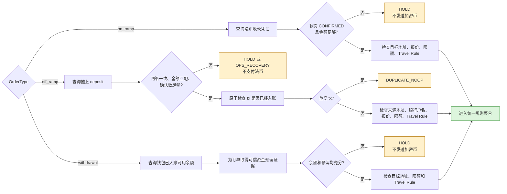
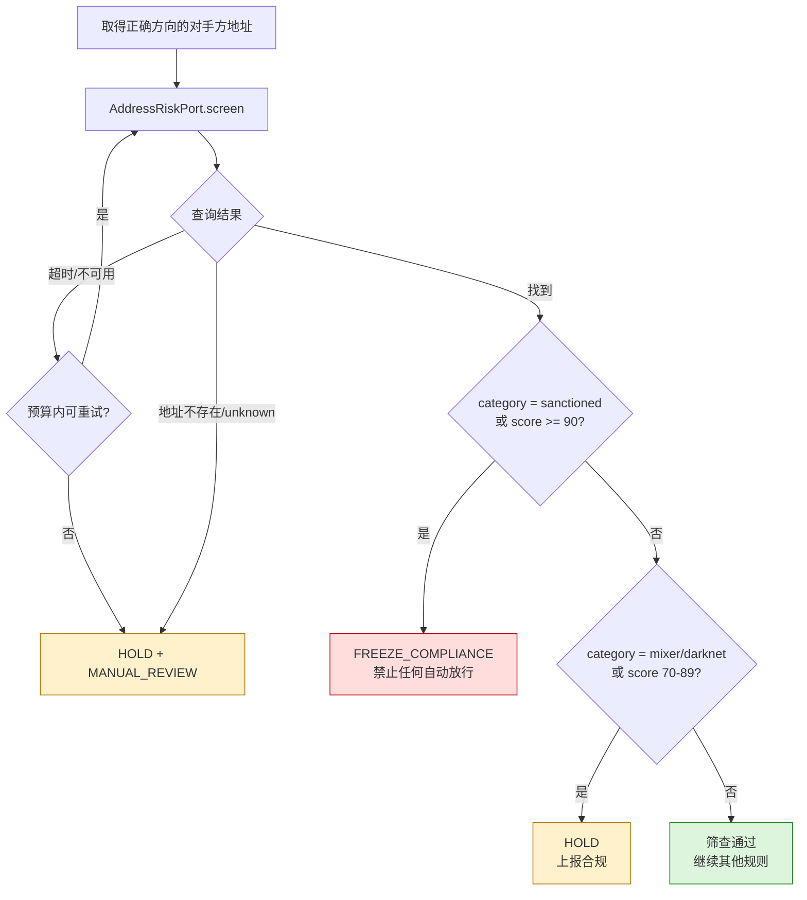
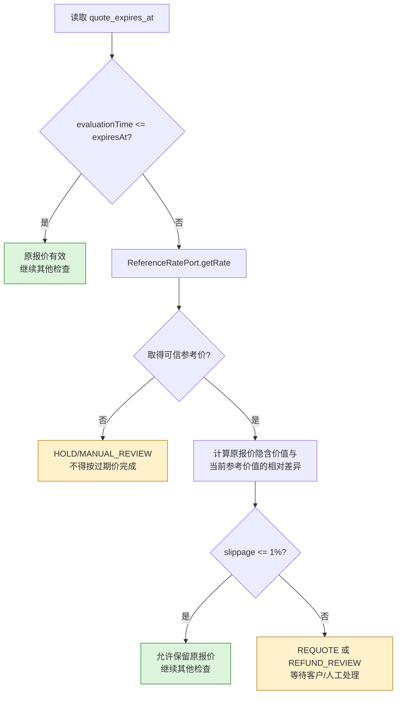
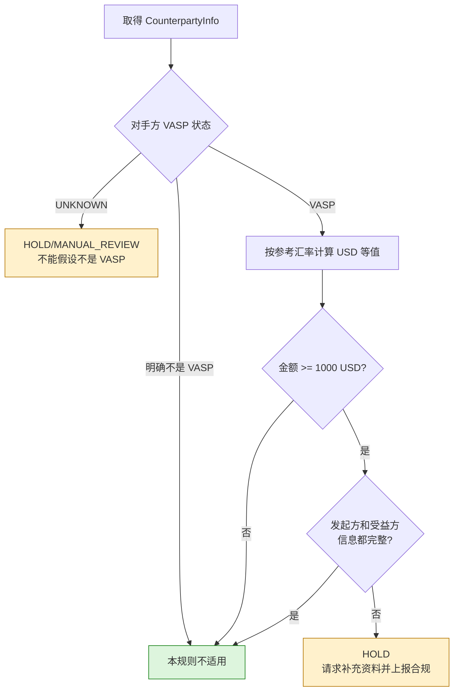
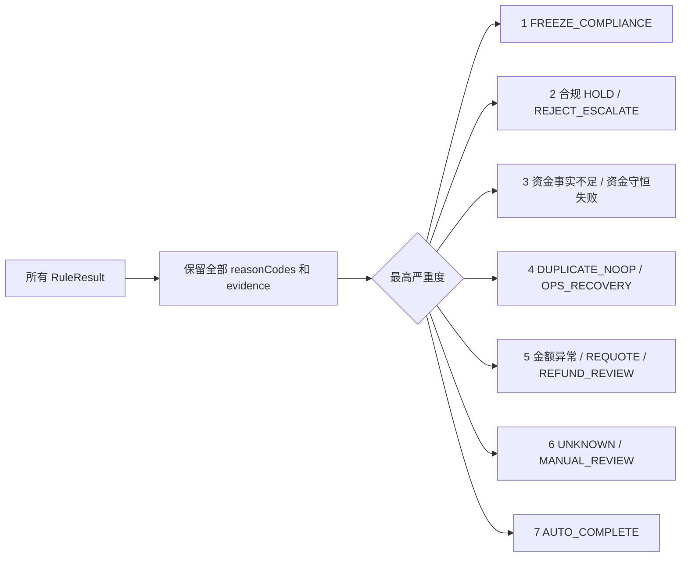
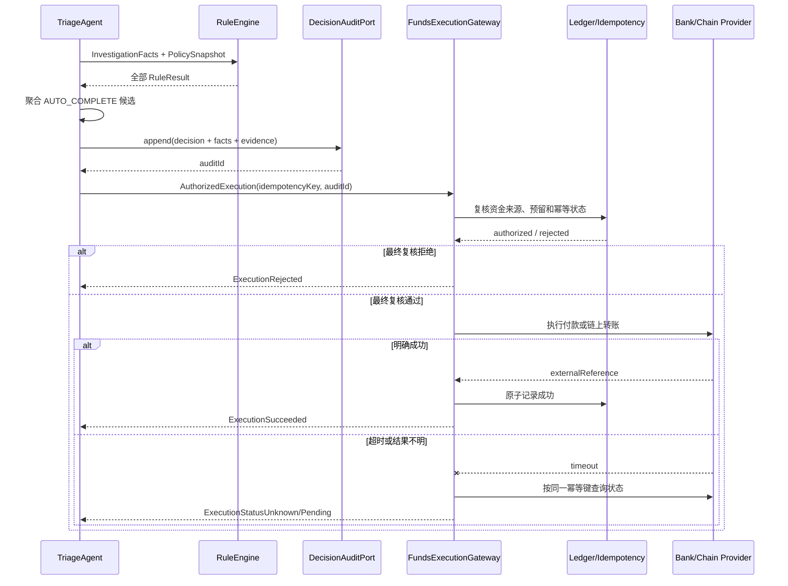

# 出入金订单异常分诊 Agent——核心流程图

## 1. 流程目标

核心流程需要保证：

- 每笔订单都经过可信事实查询和确定性规则判断。
- 所有可能命中的规则尽量完整评估，不能用普通 first-match 漏掉更高风险。
- 任何信息缺失、工具失败或规则不确定都不能自动放款或发币。
- 决策先审计，资金动作后执行。
- 重试、重复投递和并发处理不产生重复资金动作。

相关文档：

- [需求分析](./INTERVIEW_REQUIREMENTS_ANALYSIS.md)
- [接口定义](./INTERFACE_DEFINITIONS.md)

## 2. 端到端核心流程

```mermaid
flowchart TD
    START([启动 triage 命令]) --> LOAD[加载运行配置<br/>materials、policy、固定时钟、执行模式]
    LOAD --> LOAD_OK{配置和权威数据<br/>能否加载?}
    LOAD_OK -- 否 --> FATAL[输出启动错误<br/>退出码 2 或 3]
    LOAD_OK -- 是 --> OPEN[打开 orders.jsonl<br/>生成 runId]
    OPEN --> READ{读取下一行}
    READ -- 文件结束 --> SUMMARY[汇总各处置数量、失败数、耗时]
    SUMMARY --> EXIT([写评测/运行摘要并正常退出])
    READ -- 读取成功 --> ENVELOPE[建立 RawOrderEnvelope<br/>记录行号、来源、payload hash]

    subgraph S1[阶段一：解析、校验和订单级幂等]
        ENVELOPE --> PARSE[OrderParser.parse]
        PARSE --> PARSE_OK{能否解析成<br/>合法类型订单?}
        PARSE_OK -- 否 --> INVALID[构造 INVALID_INPUT<br/>记录全部输入违规]
        PARSE_OK -- 是 --> CLAIM[OrderProcessingPort.claimOrder<br/>orderId + payload hash]
        CLAIM --> CLAIM_STATE{ClaimStatus}
        CLAIM_STATE -- 已完成且载荷相同 --> REPLAY[返回此前相同结果<br/>不重复调查和执行]
        CLAIM_STATE -- 正在处理 --> IN_PROGRESS[标记暂时跳过/稍后重试]
        CLAIM_STATE -- 同 orderId 载荷冲突 --> ORDER_CONFLICT[MANUAL_REVIEW<br/>ORDER_PAYLOAD_CONFLICT]
        CLAIM_STATE -- ACQUIRED --> POLICY[取得 PolicySnapshot<br/>固定 policyVersion]
    end

    subgraph S2[阶段二：Agent 有界调查与事实收集]
        POLICY --> PLAN[按订单类型生成固定调查计划<br/>设置工具次数、超时和重试预算]
        PLAN --> COMMON_FACTS[并行查询公共事实]
        COMMON_FACTS --> CUSTOMER[CustomerProfilePort<br/>客户、状态、KYC、限额]
        COMMON_FACTS --> ASSET[AssetPolicyPort<br/>支持性、最低额、确认数]
        COMMON_FACTS --> ADDRESS[AddressRiskPort<br/>筛查正确方向地址]

        PLAN --> TYPE{订单类型}
        TYPE -- on_ramp --> ON_FUND[FiatReceiptPort<br/>查询法币是否真实确认到账]
        TYPE -- off_ramp --> OFF_FUND[BlockchainDepositPort<br/>查询网络、金额、确认数和状态]
        TYPE -- withdrawal --> WD_FUND[WalletFundsPort<br/>查询已入账可用余额/资金预留证据]

        OFF_FUND --> EVENT_KEY[生成 FundsEventKey<br/>network + txHash + transferIndex]
        EVENT_KEY --> DUP[FundsEventRegistryPort<br/>检查是否已入账/处理中/冲突]

        CUSTOMER --> CONDITIONAL
        ASSET --> CONDITIONAL
        ADDRESS --> CONDITIONAL
        ON_FUND --> CONDITIONAL
        DUP --> CONDITIONAL
        WD_FUND --> CONDITIONAL

        CONDITIONAL{是否需要补充事实?}
        CONDITIONAL -- 报价已过期或需 USD 等值 --> RATE[ReferenceRatePort<br/>取得可审计参考汇率]
        CONDITIONAL -- 对手可能是 VASP --> TRAVEL[TravelRulePort<br/>检查阈值及双方信息]
        CONDITIONAL -- 不需要 --> FACT_SET[汇总 InvestigationFacts]
        RATE --> FACT_SET
        TRAVEL --> FACT_SET
    end

    subgraph S3[统一工具失败处理]
        TOOL_FAIL[任一查询返回临时失败/超时] --> RETRYABLE{可重试且<br/>仍在预算内?}
        RETRYABLE -- 是 --> RETRY[指数退避后重试该工具]
        RETRY --> COMMON_FACTS
        RETRYABLE -- 否 --> UNKNOWN_FACT[记录 TOOL_UNAVAILABLE<br/>事实状态为 UNKNOWN]
        UNKNOWN_FACT --> FACT_SET
    end

    CUSTOMER -. 临时失败 .-> TOOL_FAIL
    ASSET -. 临时失败 .-> TOOL_FAIL
    ADDRESS -. 临时失败 .-> TOOL_FAIL
    ON_FUND -. 临时失败 .-> TOOL_FAIL
    OFF_FUND -. 临时失败 .-> TOOL_FAIL
    WD_FUND -. 临时失败 .-> TOOL_FAIL
    RATE -. 临时失败 .-> TOOL_FAIL
    TRAVEL -. 临时失败 .-> TOOL_FAIL

    subgraph S4[阶段三：确定性规则评估]
        FACT_SET --> RULES[RuleEngine.evaluateAll<br/>纯函数、无副作用]
        RULES --> R1[输入与必要事实完整性]
        RULES --> R2[客户状态、KYC 和限额]
        RULES --> R3[资产/网络支持与最低金额]
        RULES --> R4[地址风险与制裁]
        RULES --> R5[到账、确认数和资金预留]
        RULES --> R6[金额匹配与资金守恒]
        RULES --> R7[报价有效期和 1% 滑点]
        RULES --> R8[银行账户名，仅 off_ramp]
        RULES --> R9[Travel Rule，仅适用订单]
        RULES --> R10[重复 tx 和执行幂等]
        R1 --> ALL_RESULTS[收集所有 RuleResult]
        R2 --> ALL_RESULTS
        R3 --> ALL_RESULTS
        R4 --> ALL_RESULTS
        R5 --> ALL_RESULTS
        R6 --> ALL_RESULTS
        R7 --> ALL_RESULTS
        R8 --> ALL_RESULTS
        R9 --> ALL_RESULTS
        R10 --> ALL_RESULTS
    end

    subgraph S5[阶段四：决策聚合]
        ALL_RESULTS --> AGG[DecisionAggregator<br/>按严重度聚合，保留全部原因码]
        AGG --> SANCTION{制裁类别<br/>或风险分 >= 90?}
        SANCTION -- 是 --> D_FREEZE[FREEZE_COMPLIANCE]
        SANCTION -- 否 --> COMPLIANCE{mixer/darknet、风险 70-89、<br/>银行红旗、客户非 active、Travel Rule 缺失?}
        COMPLIANCE -- 是 --> D_COMPLIANCE[HOLD 或 REJECT_ESCALATE<br/>并要求合规工单]
        COMPLIANCE -- 否 --> FUNDS{到账/预留未证明、<br/>确认数不足或资金守恒失败?}
        FUNDS -- 是 --> D_HOLD[HOLD 或 MANUAL_REVIEW<br/>禁止资金动作]
        FUNDS -- 否 --> DUPLICATE{资金事件已经处理?}
        DUPLICATE -- 是 --> D_DUP[DUPLICATE_NOOP<br/>关联首次处理记录]
        DUPLICATE -- 否 --> SUPPORT{资产/网络不支持<br/>或实际网络错配?}
        SUPPORT -- 是 --> D_OPS[OPS_RECOVERY]
        SUPPORT -- 否 --> AMOUNT{少付、多付<br/>或低于最低金额?}
        AMOUNT -- 是 --> D_AMOUNT[MANUAL_REVIEW<br/>运维决定部分处理/退款]
        AMOUNT -- 否 --> QUOTE{报价过期且<br/>滑点 > 1%?}
        QUOTE -- 是 --> D_REQUOTE[REQUOTE 或 REFUND_REVIEW]
        QUOTE -- 否 --> UNKNOWN{是否存在 UNKNOWN、冲突<br/>或工具预算耗尽?}
        UNKNOWN -- 是 --> D_MANUAL[MANUAL_REVIEW 或 HOLD]
        UNKNOWN -- 否 --> D_AUTO[AUTO_COMPLETE 候选]
    end

    subgraph S6[阶段五：解释和强制审计]
        D_FREEZE --> EXPLAIN
        D_COMPLIANCE --> EXPLAIN
        D_HOLD --> EXPLAIN
        D_DUP --> EXPLAIN
        D_OPS --> EXPLAIN
        D_AMOUNT --> EXPLAIN
        D_REQUOTE --> EXPLAIN
        D_MANUAL --> EXPLAIN
        D_AUTO --> EXPLAIN
        INVALID --> EXPLAIN
        ORDER_CONFLICT --> EXPLAIN
        IN_PROGRESS --> EXPLAIN
        REPLAY --> OUTPUT

        EXPLAIN[DecisionExplanationService<br/>默认使用确定性模板]
        EXPLAIN --> LLM_OK{可选 LLM 润色成功?}
        LLM_OK -- 是 --> VERIFY_TEXT[校验解释与结构化决定一致]
        LLM_OK -- 否或未启用 --> TEMPLATE[使用模板解释]
        VERIFY_TEXT -- 不一致 --> TEMPLATE
        VERIFY_TEXT -- 一致 --> AUDIT
        TEMPLATE --> AUDIT[DecisionAuditPort.append<br/>事实、工具、规则、决定、策略版本]
        AUDIT --> AUDIT_OK{审计写入成功?}
        AUDIT_OK -- 否 --> AUDIT_FAIL[系统失败/隔离<br/>绝不执行副作用]
        AUDIT_OK -- 是 --> ACTION
    end

    subgraph S7[阶段六：按处置执行受控副作用]
        ACTION{最终处置}
        ACTION -- FREEZE/HOLD/REJECT --> CASE_C[CaseManagementPort<br/>幂等创建合规/人工工单]
        ACTION -- OPS_RECOVERY/REFUND_REVIEW --> CASE_O[CaseManagementPort<br/>幂等创建运维/退款工单]
        ACTION -- DUPLICATE_NOOP/INVALID_INPUT --> NOOP[不产生资金动作]
        ACTION -- AUTO_COMPLETE --> MODE{ExecutionMode}
        MODE -- DECISION_ONLY --> REC_ONLY[只记录可执行决定<br/>本题推荐模式]
        MODE -- SIMULATED/LIVE --> EXEC_GATE[FundsExecutionGateway<br/>独立复核七项安全条件]
        EXEC_GATE --> RECHECK{最终复核通过?}
        RECHECK -- 否 --> EXEC_REJECT[拒绝执行并转人工]
        RECHECK -- 是 --> EXECUTE[用幂等键执行付款/发币]
        EXECUTE --> EXEC_STATE{执行结果}
        EXEC_STATE -- 成功 --> EXEC_SUCCESS[记录外部引用和成功状态]
        EXEC_STATE -- 明确拒绝 --> EXEC_REJECT
        EXEC_STATE -- 超时/状态未知 --> QUERY_STATUS[按幂等键查询远端状态<br/>禁止盲目重试]

        CASE_C --> COMPLETE_STATE
        CASE_O --> COMPLETE_STATE
        NOOP --> COMPLETE_STATE
        REC_ONLY --> COMPLETE_STATE
        EXEC_SUCCESS --> COMPLETE_STATE
        EXEC_REJECT --> COMPLETE_STATE
        QUERY_STATUS --> COMPLETE_STATE
    end

    AUDIT_FAIL --> COMPLETE_STATE
    COMPLETE_STATE[OrderProcessingPort.complete/fail<br/>保存最终处理状态] --> OUTPUT[写 decisions.jsonl<br/>单笔结果和 auditId]
    OUTPUT --> READ

    classDef danger fill:#ffdddd,stroke:#b30000,color:#550000;
    classDef hold fill:#fff1cc,stroke:#b37400,color:#5c3b00;
    classDef safe fill:#ddf5dd,stroke:#168016,color:#073f07;
    classDef system fill:#ddeeff,stroke:#245b9e,color:#102e55;
    class D_FREEZE,AUDIT_FAIL danger;
    class D_COMPLIANCE,D_HOLD,D_MANUAL,D_REQUOTE,D_AMOUNT,D_OPS,EXEC_REJECT hold;
    class D_AUTO,EXEC_SUCCESS safe;
    class LOAD,OPEN,PLAN,RULES,AGG,AUDIT,EXEC_GATE system;
```

## 3. 三类订单的资金事实分支

当前题目没有钱包余额和资金预留材料，因此 `withdrawal` 的 `WD1/WD2` 无法取得可信事实，默认应走 `WD_HOLD`，除非在 `DECISIONS.md` 中明确采用题目级假设。

## 4. 地址风险决策子流程

即使订单已经因为金额、网络或重复交易不能完成，地址筛查结果仍应记录；重复交易不能吞掉新的制裁风险事件。

## 5. 报价过期与滑点子流程

## 6. Travel Rule 子流程

## 7. 决策严重度与多规则命中

系统不是遇到第一条失败就结束，而是尽量完成所有安全相关检查，再根据最严重结果决定最终处置：

补充规则：

- 制裁命中永远优先，且必须创建合规事件。
- 最终处置只有一个，但审计保留全部命中原因。
- `DUPLICATE_NOOP` 表示不重复动钱，不表示可以忽略该订单的合规风险。
- `AUTO_COMPLETE` 必须是所有强制条件都明确通过，而不是“没有发现失败”。

## 8. 自动完成后的双重校验

本题默认使用 `DECISION_ONLY`，流程在审计后输出决定，不连接真实 Provider。保留执行网关接口是为了说明生产环境如何保证 Agent 的错误不会直接变成资金损失。

## 9. 核心接口与流程节点对应

| 流程阶段 | 核心接口 | 主要产物 |
| --- | --- | --- |
| 输入 | `OrderParser` | `ParsedOrder` / `InvalidOrder` |
| 订单防重 | `OrderProcessingPort` | `ProcessingClaim` |
| 公共事实 | `CustomerProfilePort`、`AssetPolicyPort`、`AddressRiskPort` | 客户、资产和风险证据 |
| 资金事实 | `FiatReceiptPort`、`BlockchainDepositPort`、`WalletFundsPort` | 可信到账/预留证据 |
| 资金事件防重 | `FundsEventRegistryPort` | 首次、已入账、处理中或冲突 |
| 补充事实 | `ReferenceRatePort`、`TravelRulePort` | 汇率和 Travel Rule 结果 |
| 规则判断 | `RuleEngine` | 全部 `RuleResult` |
| 决策 | `DecisionAggregator` | `TriageDecision` |
| 解释 | `DecisionExplanationService` | 人类可读说明 |
| 审计 | `DecisionAuditPort` | `auditId` 和完整证据链 |
| 人工处理 | `CaseManagementPort` | 合规/运维/退款 case |
| 资金执行 | `FundsExecutionGateway` | 成功、拒绝、等待或状态未知 |
| 批次输出 | `ProcessOrderBatchUseCase` | decisions JSONL 和批次摘要 |

## 10. 流程验收检查点

1. 任一外部事实查询失败，流程不会进入资金执行。
2. 地址风险检查不会被金额错误、重复交易或客户备注跳过。
3. 同一 `tx_hash` 的并发订单至多一个能够取得资金事件 claim。
4. `AUTO_COMPLETE` 必须经过审计成功后才能交给执行网关。
5. 执行网关再次校验资金事实和幂等状态。
6. 执行超时后查询状态，不盲目发起第二笔资金动作。
7. LLM 失败或输出冲突只影响文案，不影响结构化决定。
8. 单笔失败被隔离，批次继续处理下一行。
9. 相同输入、事实快照和策略版本能够重放得到相同决定。
10. 每个最终处置都能追溯到规则、事实、工具调用和策略版本。

## 11. 当前假设和待定项

- 当前流程使用固定策略时间，生产运行改为注入系统时钟。
- 文件中的到账字段仅作为题目 stub；生产环境必须独立查询支付网关或链节点。
- `withdrawal` 缺少钱包余额/预留数据，默认挂起。
- 月累计额度缺失，是否仅按单笔限额判断需要写入 `DECISIONS.md`。
- 低于最低金额的最终处置仍是策略留白，默认人工处理。
- 本题只输出决定和审计，不真实付款、发币或退款。
