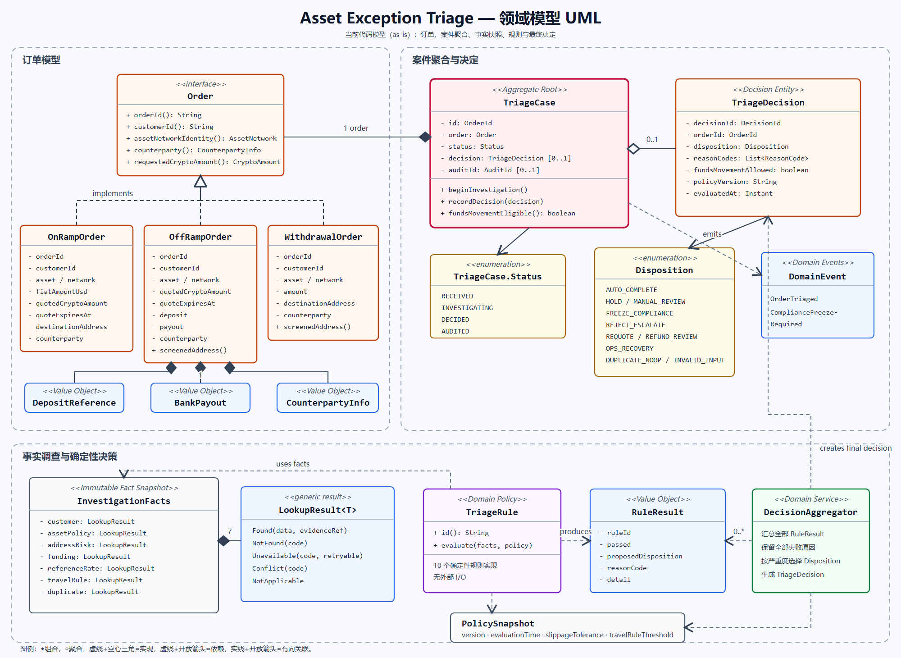
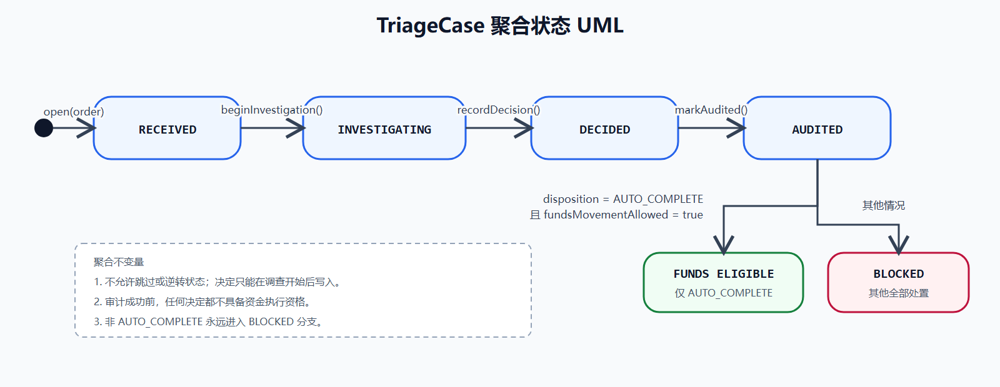
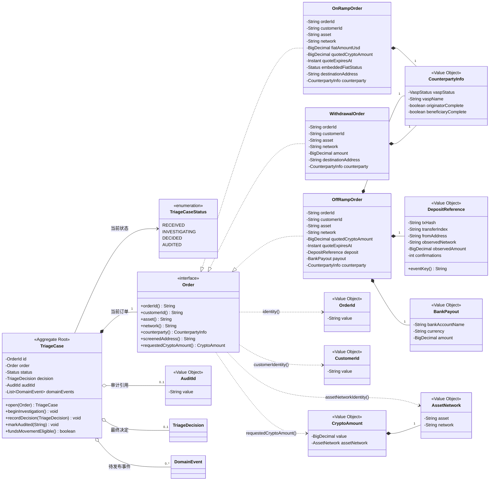
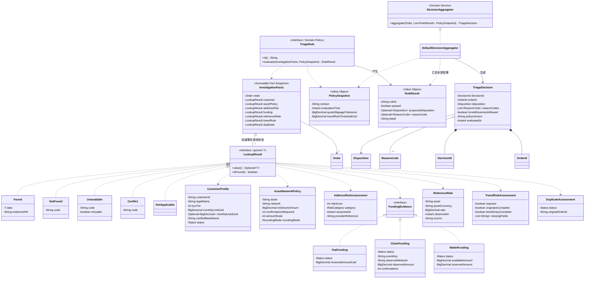
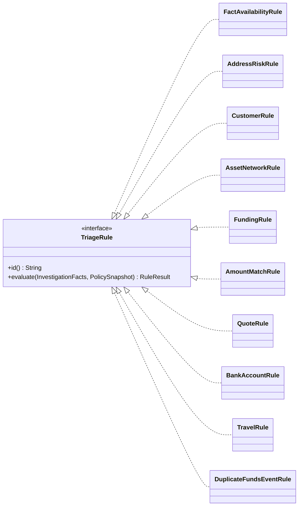
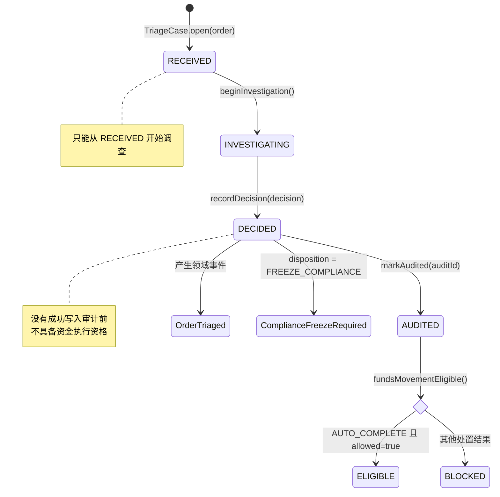

# 领域模型 UML

本文档依据当前 `src/main/java/com/jason/yang/asset/domain` 代码生成，描述的是当前实现（as-is），不是脱离代码的理想模型。

## 直观 UML 图

下面两张是可直接打开、缩放且适合放进面试材料的 SVG UML 图：

图片原文件：

- [领域模型类图](images/domain-model-uml.svg)
- [领域模型类图 PNG（IDEA 直接预览）](images/domain-model-uml.png)
- [TriageCase 状态图](images/triage-case-state-uml.svg)
- [TriageCase 状态图 PNG（IDEA 直接预览）](images/triage-case-state-uml.png)

组合关系说明：实心菱形位于“整体”一端。例如 `OffRampOrder ◆── DepositReference` 中，菱形必须靠近 `OffRampOrder`；`DepositReference` 是被包含的部分。

关系符号采用标准 UML 语义：

- `◆──`：组合，实心菱形位于整体一端；
- `◇──`：聚合，空心菱形位于聚合方；
- `- - -▷`：接口实现，虚线加空心三角形，三角形指向接口；
- `- - ->`：依赖，虚线加开放箭头，箭头指向被依赖对象；
- `──>`：有向关联，实线加开放箭头。

因此 `TriageRule - - -> PolicySnapshot` 表示规则使用策略快照，方向不能反过来。

## 1. DDD 角色概览

| DDD 角色 | 当前模型 | 主要职责 |
|---|---|---|
| 聚合根 | `TriageCase` | 维护分流案件生命周期，保证决定、审计、资金执行资格的顺序 |
| 订单实体 | `OnRampOrder`、`OffRampOrder`、`WithdrawalOrder` | 表达三种出入金业务订单 |
| 决定实体 | `TriageDecision` | 保存决定标识、处置结果、原因、策略版本和评估时间 |
| 值对象 | `OrderId`、`CustomerId`、`AssetNetwork`、`CryptoAmount`、`FiatMoney`、`AuditId` 等 | 校验并表达不可变业务概念 |
| 事实快照 | `InvestigationFacts`、`LookupResult<T>` | 保存权威查询结果及其可用状态 |
| 领域策略 | `TriageRule` 的各个实现 | 使用已知事实和策略快照做确定性判断 |
| 领域服务 | `DefaultDecisionAggregator` | 汇总全部规则结果并选择最终处置结果 |
| 领域事件 | `OrderTriaged`、`ComplianceFreezeRequired` | 表达已经发生的分流与合规冻结事实 |

## 2. 核心聚合与订单模型

## 3. 调查事实、规则与最终决定

具体 `TriageRule` 实现如下：

## 4. 聚合状态图

## 5. 核心领域不变量

1. `TriageCase` 只能按 `RECEIVED -> INVESTIGATING -> DECIDED -> AUDITED` 顺序变化。
2. 决定必须属于当前案件的 `OrderId`，不能把其他订单的决定写入本案件。
3. 审计只能附加到已经产生决定的案件。
4. 只有状态为 `AUDITED`、处置为 `AUTO_COMPLETE` 且决定明确允许资金动作时，`fundsMovementEligible()` 才返回 `true`。
5. 规则只读取 `InvestigationFacts` 和 `PolicySnapshot`，不执行外部 I/O。
6. 所有失败规则的 `ReasonCode` 都会保留，但最终 `Disposition` 按失败关闭优先级聚合。
7. `Unavailable` 表示暂时无法得到事实，进入 `HOLD`；`Conflict` 表示权威事实互相矛盾，进入 `MANUAL_REVIEW`。

## 6. 模型边界说明

- `TriageCase` 是当前唯一明确的聚合根。
- `InvestigationFacts` 是一次评估使用的不可变事实快照，不属于 `TriageCase` 内部持久化状态。
- `PolicySnapshot` 记录本次决定使用的策略版本和阈值，保证历史决定可以解释和回放。
- LLM Agent、查询 Port、Controller、CLI 和文件适配器不属于领域模型，因此没有放入本 UML；它们只负责收集事实或驱动领域模型。
- 当前订单类内部仍保存部分 `String`、`BigDecimal` 字段，并通过构造函数和值对象进行校验。若继续深化 DDD，可以直接把字段类型收敛为 `OrderId`、`CustomerId`、`AssetNetwork` 和 `CryptoAmount`。
