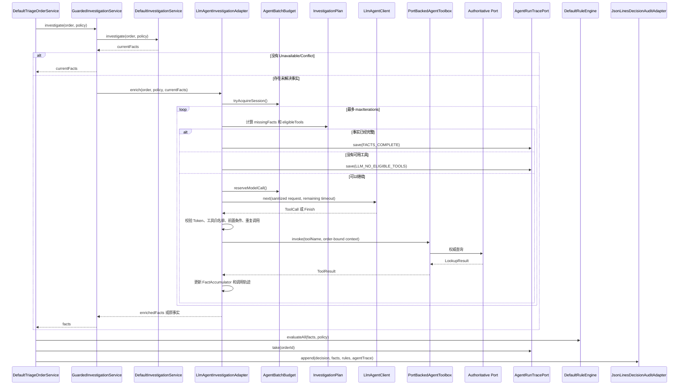

# LLM Demo 代码走读手册

## 1. 阅读目标

这份手册只讲 LLM Demo 链路，不重复离线批处理和领域规则的完整流程。

读完后应该能够回答：

1. 什么情况下会调用 LLM，什么情况下完全不调用？
2. 模型如何知道当前可以调用哪些工具？
3. 模型能向工具传入哪些参数？
4. 如何防止重复调用、无限循环、超时和成本失控？
5. Stub、Replay 和 HTTP Provider 如何切换？
6. 模型失败后为什么不会错误放行资金？
7. LLM 调用轨迹如何进入订单审计？
8. 如果替换真实模型，需要改哪些类，不应该改哪些类？

先记住整个设计的核心边界：

> LLM 只选择下一项权威查询工具，不生成最终 `Disposition`。工具返回的事实仍然交给确定性领域规则处理。

## 2. LLM Demo 在主流程中的位置

```text
DefaultTriageOrderService
  -> GuardedInvestigationService
       -> DefaultInvestigationService
            先完成便宜、确定性的权威查询
       -> LlmAgentInvestigationAdapter
            仅在事实 Unavailable/Conflict 时补查
            -> LlmAgentClient
                 stub / replay / http
            -> PortBackedAgentToolbox
                 调用已有权威 Port
  -> DefaultRuleEngine
       确定性规则
  -> DefaultDecisionAggregator
       唯一最终决定
  -> JsonLinesDecisionAuditAdapter
       决定、规则和 Agent 轨迹统一落盘
```

LLM 链路属于基础设施层。领域规则不依赖模型 Provider，也不读取模型自然语言。

## 3. 推荐走读顺序

### 3.1 第一轮：先看主干

按顺序阅读：

1. `application/service/GuardedInvestigationService.java`
2. `application/port/AgentEnrichmentPort.java`
3. `infrastructure/agent/llm/LlmAgentInvestigationAdapter.java`
4. `infrastructure/agent/llm/InvestigationPlan.java`
5. `infrastructure/agent/llm/LlmAgentClient.java`
6. `infrastructure/agent/llm/AgentToolDefinition.java`
7. `infrastructure/agent/llm/AgentToolbox.java`
8. `infrastructure/agent/llm/PortBackedAgentToolbox.java`

第一轮重点理解“发现缺失事实、生成计划、模型选择工具、服务端执行工具、事实重新进入循环”。

### 3.2 第二轮：再看安全保护

1. `AgentExecutionPolicy.java`
2. `AgentBatchBudget.java`
3. `TimeoutEnforcingLlmAgentClient.java`
4. `EnvironmentLlmAgentClientFactory.java`
5. `StubLlmAgentClient.java`
6. `ReplayLlmAgentClient.java`
7. `HttpLlmAgentClient.java`
8. `InMemoryAgentRunTraceAdapter.java`

### 3.3 第三轮：用测试验证理解

1. `LlmAgentInvestigationAdapterTest.java`
2. `LlmProviderSafetyTest.java`
3. `ExerciseTestControllerIntegrationTest.java`
4. `OfflineBatchIntegrationTest.java`

## 4. 完整时序图



## 5. 第一道闸门：GuardedInvestigationService

文件：

```text
src/main/java/com/jason/yang/asset/application/service/GuardedInvestigationService.java
```

主方法：

```java
public InvestigationFacts investigate(Order order, PolicySnapshot policy) {
    InvestigationFacts facts =
            deterministicInvestigation.investigate(order, policy);

    if (!hasUnresolvedFacts(facts)) {
        return facts;
    }

    return enrichmentPort.enrich(order, policy, facts);
}
```

它实现的是“确定性优先”：

```text
先查询文件、Stub 或权威服务
    -> 查询都得到明确结果：不花模型成本
    -> 存在未解决事实：才进入 Agent
```

触发 Agent 的结果类型只有：

```java
LookupResult.Unavailable
LookupResult.Conflict
```

以下类型被认为已经解决，不进入 Agent：

| LookupResult | 含义 |
|---|---|
| `Found` | 权威查询成功且有数据 |
| `NotFound` | 权威来源明确表示不存在 |
| `NotApplicable` | 当前业务不需要这项事实 |

注意：`NotFound` 不是技术失败，应由领域规则处理；模型不应该把“明确不存在”猜成“可能存在”。

## 6. Agent 的统一入口：AgentEnrichmentPort

应用层只知道：

```java
InvestigationFacts enrich(
        Order order,
        PolicySnapshot policy,
        InvestigationFacts currentFacts
);
```

应用层不知道底层使用 Stub、回放文件、HTTP Gateway 还是其他模型。

当前实现：

```text
AgentEnrichmentPort
    -> LlmAgentInvestigationAdapter
```

以后更换 Agent 框架，可以提供另一个 `AgentEnrichmentPort` 实现，但不能让新实现绕过 `InvestigationFacts` 和确定性规则边界。

## 7. 核心循环：LlmAgentInvestigationAdapter.enrich()

这是 LLM Demo 最重要的方法，建议逐段阅读。

### 7.1 初始化本次会话

```java
Counters counters = new Counters();
FactAccumulator facts = new FactAccumulator(currentFacts);
Set<String> completed = new LinkedHashSet<String>();
List<String> observations = new ArrayList<String>();
List<AgentToolTrace> toolTraces = new ArrayList<AgentToolTrace>();
```

各变量作用：

| 变量 | 用途 |
|---|---|
| `counters` | 记录迭代、模型调用、工具调用、重试和 Token |
| `facts` | 保存七个事实槽位的当前值 |
| `completed` | 防止同一工具重复调用 |
| `observations` | 只保存 `tool=resultType` 摘要，提供给下一轮模型 |
| `toolTraces` | 保存工具名称、结果类型和耗时，用于审计 |

### 7.2 获取整批并发许可

```java
boolean acquired = batchBudget.tryAcquireSession();
```

当前使用非阻塞 `Semaphore.tryAcquire()`：

```text
有许可
    -> 立即开始

没有许可
    -> 不排队等待
    -> stopReason = LLM_CONCURRENCY_LIMIT
    -> 返回原事实
```

这样可以防止上万单同时堆积在模型调用处。

### 7.3 每轮重新规划

```java
for (int iteration = 1;
     iteration <= executionPolicy.maxIterations();
     iteration++) {
    InvestigationPlan plan = plan(order, facts, completed);
    ...
}
```

每执行一个工具后都会重新计算计划，而不是一次把所有调用交给模型。

原因是：

- 新事实可能使后续工具变得可用。
- 工具可能返回 `Unavailable`，不能假装问题已解决。
- 已调用工具必须从白名单中移除。
- 剩余预算会变化。

### 7.4 事实完整则停止

```java
if (plan.complete()) {
    return stopped(..., "FACTS_COMPLETE");
}
```

`complete()` 只表示没有 `Unavailable/Conflict` 的事实槽位，不代表所有事实都必须是 `Found`。`NotFound` 和 `NotApplicable` 也属于确定结果。

### 7.5 没有可用工具则停止

```java
if (plan.eligibleTools().isEmpty()) {
    return stopped(..., "LLM_NO_ELIGIBLE_TOOLS");
}
```

典型场景：

1. `funding` 是 `Unavailable`。
2. Agent 调用一次 `funding` 工具。
3. 权威 Port 仍返回 `Unavailable`。
4. `funding` 已在 completed 中，禁止重复调用。
5. 事实仍缺失，但没有新工具可以解决。
6. Agent 停止，后续规则产生 `HOLD`。

## 8. FactAccumulator 如何判断缺失事实

它使用 `EnumMap<FactType, LookupResult<?>>` 保存七类事实：

```text
CUSTOMER
ASSET_POLICY
ADDRESS_RISK
FUNDING
REFERENCE_RATE
TRAVEL_RULE
DUPLICATE
```

判断逻辑：

```java
private boolean resolved(LookupResult<?> result) {
    return !(result instanceof LookupResult.Unavailable)
            && !(result instanceof LookupResult.Conflict);
}
```

因此：

```text
Unavailable / Conflict -> missing
Found / NotFound / NotApplicable -> resolved
```

工具结果会覆盖对应事实槽位：

```java
facts.put(result.factType(), result.value());
```

这里的“覆盖”是用新一次权威查询结果替换旧的不可用结果，不是让模型直接写入事实。

## 9. InvestigationPlan 如何筛选本轮工具

`plan()` 从 Toolbox 的完整工具表中筛选 `eligibleTools`：

```java
if (!completed.contains(tool.name())
        && tool.appliesTo(order)
        && missing.contains(tool.producesFact())
        && facts.resolved(tool.prerequisites())) {
    eligible.add(tool);
}
```

工具必须同时满足：

1. 本次会话尚未调用。
2. 适用于当前订单类型。
3. 当前确实缺少它能产生的事实。
4. 所有前置事实已经明确。

模型看到的不是系统全部工具，而是当前这一轮经过服务端计算后的可用子集。

## 10. AgentToolDefinition：工具元数据

`AgentToolDefinition` 描述：

| 字段 | 作用 |
|---|---|
| `name` | 模型返回的工具名称 |
| `description` | 告诉模型工具用途 |
| `producesFact` | 工具能够填充的事实槽位 |
| `applicableOrderTypes` | 允许使用的订单类型 |
| `prerequisites` | 调用前必须取得的事实 |

它只是工具定义的数据结构，不负责执行工具。

真正的白名单注册位于：

```text
PortBackedAgentToolbox 构造方法
```

## 11. 当前七个白名单工具

| 工具名 | 产生事实 | 实际调用的 Port | 订单范围 |
|---|---|---|---|
| `customer_profile` | `CUSTOMER` | `CustomerProfilePort` | 全部 |
| `asset_policy` | `ASSET_POLICY` | `AssetPolicyPort` | 全部 |
| `address_risk` | `ADDRESS_RISK` | `AddressRiskPort` | 全部 |
| `funding` | `FUNDING` | 按订单选择资金 Port | 全部 |
| `reference_rate` | `REFERENCE_RATE` | `ReferenceRatePort` | 全部 |
| `travel_rule` | `TRAVEL_RULE` | `TravelRulePort` | 全部 |
| `duplicate_funds_event` | `DUPLICATE` | `FundsEventRegistryPort` | 仅 OffRamp |

`travel_rule` 声明 `REFERENCE_RATE` 为前置事实。对于需要美元估值的提现，只有参考价格已经明确后才会出现在模型工具列表中。

### funding 工具的内部路由

```text
OnRampOrder
    -> FiatReceiptPort

OffRampOrder
    -> BlockchainDepositPort

WithdrawalOrder
    -> WalletFundsPort
```

## 12. 模型不能控制工具业务参数

模型只返回：

```json
{
  "type": "tool_call",
  "tool_name": "funding",
  "tokens_used": 42
}
```

模型不能返回：

```json
{
  "tool_name": "funding",
  "customer_id": "another-customer",
  "address": "attacker-address",
  "amount": 999999
}
```

工具上下文由服务端创建：

```java
new AgentToolbox.ToolContext(
        order,
        policy,
        facts.referenceRate()
)
```

具体参数从当前订单读取：

```java
customerPort.findCustomer(order.customerIdentity());
addressRiskPort.screen(
        new BlockchainAddress(order.screenedAddress(), network)
);
```

因此模型只能选择工具名称，不能借工具查询另一位客户或修改金额。

## 13. LlmAgentClient：模型无关接口

统一接口只有一个核心方法：

```java
Response next(Request request, Duration timeout);
```

模型输出被限制为两种结构：

```text
ToolCall(toolName, tokensUsed)
Finish(tokensUsed)
```

没有自由文本决定，也没有 `Disposition` 字段。

### Request 中模型能看到什么

| 字段 | 内容 |
|---|---|
| orderId | 订单业务标识 |
| orderType | OnRamp/OffRamp/Withdrawal 类型 |
| asset、network | 当前资产和网络 |
| policyVersion | 当前策略版本 |
| iteration | 当前轮次 |
| remainingToolCalls | 剩余工具预算 |
| remainingTokens | 剩余 Token 预算 |
| availableTools | 本轮允许调用的工具定义 |
| missingFacts | 未解决事实类型 |
| completedTools | 已执行工具名称 |
| observationSummaries | `tool=FOUND/UNAVAILABLE/...` 摘要 |

有意不提供：

- 原始订单 JSON。
- `customer_note`。
- API Key。
- 完整客户资料。
- 完整工具结果内容。
- 领域规则优先级。
- 资金执行接口。

## 14. 模型响应如何被服务端验证

模型返回后依次校验：

### 14.1 Token 合法性

```text
tokensUsed < 0
    -> LLM_INVALID_TOKEN_USAGE

tokensUsed 超过单单剩余预算
    -> LLM_MAX_TOKENS_EXCEEDED
```

### 14.2 不允许事实缺失时提前 Finish

```java
if (response instanceof Finish) {
    throw new AgentStopped("LLM_INCOMPLETE_FACTS");
}
```

计划完整时 Adapter 会在调用模型之前结束，因此模型收到请求就表示仍有未解决事实。此时返回 `Finish` 不能被当作成功。

### 14.3 工具必须属于本轮 eligibleTools

```text
不存在、类型不适用、前置事实不足、已经完成
    -> LLM_TOOL_NOT_ALLOWED_OR_NOT_READY
```

### 14.4 工具调用数限制

```text
达到 maxToolCalls
    -> LLM_MAX_TOOL_CALLS_EXCEEDED
```

### 14.5 工具结果类型必须匹配定义

例如 `customer_profile` 必须返回：

```text
FactType.CUSTOMER
```

如果 Toolbox 返回其他 FactType：

```text
LLM_INVALID_TOOL_RESULT
```

模型不能用一个工具结果填充任意事实槽位。

## 15. 三种 Provider

Provider 由 `EnvironmentLlmAgentClientFactory` 根据环境变量创建。

### 15.1 Stub：默认离线模式

默认值：

```text
ASSET_LLM_PROVIDER=stub
```

`StubLlmAgentClient` 的行为非常简单：

```java
if (request.availableTools().isEmpty()) {
    return new Finish(0);
}
return new ToolCall(
        request.availableTools().get(0).name(),
        0
);
```

它不是语言模型，只是确定性选择第一个可用工具，用于验证 Agent 编排链路可以无 Key 离线运行。

Provider 和 model 审计值：

```text
provider = stub
model = offline-stub-v1
```

### 15.2 Replay：录制回放模式

配置：

```powershell
$env:ASSET_LLM_PROVIDER = "replay"
$env:ASSET_LLM_REPLAY_FILE = "C:\path\to\responses.jsonl"
```

回放文件每行是一轮结构化响应：

```json
{"type":"tool_call","tool_name":"funding","tokens_used":42}
{"type":"finish","tokens_used":12}
```

`ReplayLlmAgentClient` 在启动时加载到队列，每次调用移除第一条。队列为空会产生不可重试错误：

```text
Replay cassette exhausted
```

用途：

- 固定非确定模型的历史响应。
- 离线复现某个失败路径。
- 在没有付费 Key 的 CI 中测试编排。

注意：当前回放队列属于整个 Runtime，不按 orderId 分组；并发或订单顺序变化时，回放内容必须与实际调用顺序完全一致。

### 15.3 HTTP：真实模型 Gateway Demo

配置：

```powershell
$env:ASSET_LLM_PROVIDER = "http"
$env:ASSET_LLM_ENDPOINT = "https://gateway.example.com/agent"
$env:ASSET_LLM_API_KEY = "your-key"
$env:ASSET_LLM_MODEL = "your-model"
```

缺少 endpoint、key 或 model 时，Runtime 创建立即失败，不会悄悄回退到 Stub。

`HttpLlmAgentClient` 调用的是项目自定义的受控 Gateway 合同，不是直接绑定 OpenAI、Anthropic 等厂商 SDK。

请求示例：

```json
{
  "model": "your-model",
  "prompt_version": "investigation-v1",
  "order_id": "O-011",
  "order_type": "WithdrawalOrder",
  "asset": "BTC",
  "network": "BTC",
  "policy_version": "policy-2026-07-28",
  "iteration": 1,
  "remaining_tool_calls": 7,
  "remaining_tokens": 8000,
  "missing_facts": ["FUNDING"],
  "completed_tools": [],
  "observations": [],
  "tools": [
    {
      "name": "funding",
      "description": "Query authoritative funding, deposit or wallet reservation evidence",
      "produces_fact": "FUNDING",
      "prerequisites": []
    }
  ]
}
```

Gateway 必须返回：

```json
{
  "type": "tool_call",
  "tool_name": "funding",
  "tokens_used": 37
}
```

或者：

```json
{
  "type": "finish",
  "tokens_used": 15
}
```

其他响应类型、缺少字段或无效 Token 都是不可重试协议错误。

HTTP 客户端还限制响应最多 65,536 字节，防止异常大响应占用内存。

## 16. TimeoutEnforcingLlmAgentClient

Factory 创建任意 Provider 后都会包装：

```java
return new TimeoutEnforcingLlmAgentClient(client);
```

即使底层 Provider 忽略传入的 timeout，外层仍使用 `Future.get(timeout)` 强制超时。

线程隔离配置：

```text
固定 daemon 线程：4
有界队列：32
拒绝策略：AbortPolicy
```

行为：

| 场景 | ClientException |
|---|---|
| 线程池和队列已满 | retryable=true |
| 硬超时 | retryable=true，并取消 Future |
| 当前线程中断 | retryable=false，恢复中断标志 |
| Provider 抛 ClientException | 保留原 retryable 属性 |
| 未分类运行异常 | retryable=false |

daemon 线程不会阻止 CLI 进程退出。

## 17. 单订单限制：AgentExecutionPolicy

默认值：

| 限制 | 值 |
|---|---:|
| 最大迭代 | 8 |
| 最大工具调用 | 7 |
| 最大 Token | 8,000 |
| 总会话超时 | 30 秒 |
| 最大重试 | 2 |
| 初始重试退避 | 200 ms |

`maxRetries=2` 表示一次初始调用最多再重试两次，即最多三次尝试。

重试退避：

```text
指数增长
最大 5 秒
Full Jitter 随机抖动
不得超过会话剩余时间
```

只有 `ClientException.retryable=true` 才会重试。

## 18. 整批限制：AgentBatchBudget

默认值：

| 限制 | 值 |
|---|---:|
| 最大模型调用 | 2,000 |
| 最大 Token | 2,000,000 |
| 最大并发 Agent 会话 | 4 |
| 连续失败熔断阈值 | 5 |

### 18.1 模型调用预算

每一次尝试，包括重试，都会先调用：

```java
batchBudget.reserveModelCall();
```

因此重试同样消耗整批调用预算。

### 18.2 Token 预算

成功收到响应后记录：

```java
batchBudget.recordTokens(response.tokensUsed());
```

超过整批 Token 上限时：

```text
LLM_BATCH_TOKEN_BUDGET_EXHAUSTED
```

### 18.3 简单熔断

Provider 失败时：

```java
recordProviderFailure();
```

成功时连续失败数清零：

```java
recordProviderSuccess();
```

连续失败达到 5 次后，新模型调用停止：

```text
LLM_CIRCUIT_OPEN
```

当前熔断器没有半开和按时间自动恢复，是面试 Demo 的简化实现。

## 19. 停止原因清单

| stopReason | 含义 |
|---|---|
| `FACTS_COMPLETE` | 所有事实槽位都已明确 |
| `LLM_CONCURRENCY_LIMIT` | 并发 Agent 会话已满 |
| `LLM_NO_ELIGIBLE_TOOLS` | 仍有缺失事实，但没有可再调用的工具 |
| `LLM_INCOMPLETE_FACTS` | 模型在事实不完整时要求结束 |
| `LLM_INVALID_RESPONSE` | 返回了不支持的响应对象 |
| `LLM_EMPTY_RESPONSE` | Provider 返回 null |
| `LLM_TOOL_NOT_ALLOWED_OR_NOT_READY` | 工具不在本轮白名单或条件未满足 |
| `LLM_DUPLICATE_TOOL_CALL` | 重复调用已完成工具的保护码 |
| `LLM_MAX_TOOL_CALLS_EXCEEDED` | 单单工具调用达到上限 |
| `LLM_INVALID_TOOL_RESULT` | 工具结果为空或 FactType 不匹配 |
| `LLM_INVALID_TOKEN_USAGE` | Provider 报告负 Token |
| `LLM_MAX_TOKENS_EXCEEDED` | 超过单单 Token 预算 |
| `LLM_BATCH_TOKEN_BUDGET_EXHAUSTED` | 超过整批 Token 预算 |
| `LLM_BATCH_CALL_BUDGET_EXHAUSTED` | 超过整批模型调用预算 |
| `LLM_CIRCUIT_OPEN` | 连续 Provider 失败触发熔断 |
| `LLM_NON_RETRYABLE_FAILURE` | 不可重试 Provider 错误 |
| `LLM_RETRIES_EXHAUSTED` | 可重试错误超过重试次数 |
| `LLM_MAX_ITERATIONS_EXCEEDED` | 循环达到最大轮数 |
| `LLM_TIMEOUT` | 会话总时间耗尽 |
| `LLM_AGENT_INTERRUPTED` | 退避等待时线程被中断 |
| `LLM_AGENT_FAILURE` | 未分类运行异常，统一 fail-closed |

停止不等于业务失败，也不会产生最终决定。它只表示 Agent 不再继续补查，并将当前事实交回确定性规则。

## 20. 为什么模型失败不会自动放行

Agent 停止后：

```java
return facts.toFacts(order);
```

它不会把未解决事实替换为虚构的 `Found`。

如果仍存在 `Unavailable`：

```text
FactAvailabilityRule
    -> HOLD
    -> TOOL_UNAVAILABLE
```

如果仍存在 `Conflict`：

```text
FactAvailabilityRule
    -> MANUAL_REVIEW
    -> DATA_CONFLICT
```

最终决定仍由：

```text
DefaultRuleEngine
    -> DefaultDecisionAggregator
```

产生。`LlmAgentClient.Response` 中根本没有 `Disposition` 或 `fundsMovementAllowed` 字段。

## 21. O-011 实际链路

O-011 是当前材料中最适合调试 Agent 的订单。

```text
WithdrawalOrder O-011
    asset=BTC
    network=BTC
    amount=0.5
```

### 21.1 确定性调查

`DefaultInvestigationService` 查询：

- 客户：明确。
- 资产政策：明确。
- 地址风险：明确。
- 参考价格：明确。
- 钱包可用和预留资金：`UnavailableWalletFundsAdapter` 返回 `Unavailable`。
- Travel Rule：根据当前数据产生明确结果。
- duplicate：Withdrawal 不适用。

因此至少 `FUNDING` 是 unresolved。

### 21.2 Guard 触发 Agent

```text
hasUnresolvedFacts = true
    -> enrichmentPort.enrich(...)
```

### 21.3 第一轮计划

```text
missingFacts = [FUNDING]
eligibleTools = [funding]
```

默认 Stub 返回：

```text
ToolCall("funding", 0)
```

### 21.4 工具执行

Withdrawal 的 funding 路由到：

```text
WalletFundsPort
    -> UnavailableWalletFundsAdapter
```

仍返回 `Unavailable`。

### 21.5 第二轮停止

`FUNDING` 仍缺失，但 funding 已在 completed 中，不能重复调用：

```text
missingFacts = [FUNDING]
eligibleTools = []
stopReason = LLM_NO_ELIGIBLE_TOOLS
```

### 21.6 回到领域规则

```text
FactAvailabilityRule
    -> HOLD
    -> TOOL_UNAVAILABLE
```

模型没有能力把 O-011 改成 `AUTO_COMPLETE`。

## 22. Agent 轨迹如何进入审计

### 22.1 Agent 停止时保存

`stopped()` 创建 `AgentRunTrace`：

```text
provider
model
promptVersion
iterations
modelCalls
toolCalls
retryCount
tokensUsed
elapsedMillis
stopReason
toolTraces
```

然后按 orderId 保存：

```java
tracePort.save(order.identity(), trace);
```

### 22.2 单笔决策服务取走

`DefaultTriageOrderService` 在写审计前：

```java
Optional<AgentRunTrace> agentTrace =
        agentRunTracePort.take(order.identity());
```

`take()` 会从内存 Map 删除，避免长期累积。

### 22.3 审计文件

`JsonLinesDecisionAuditAdapter` 把 Agent 摘要写入：

```text
build/audit.jsonl
```

示例：

```json
{
  "agent": {
    "provider": "stub",
    "model": "offline-stub-v1",
    "prompt_version": "triage-tools-v1",
    "iterations": 2,
    "model_calls": 1,
    "tool_calls": 1,
    "retry_count": 0,
    "tokens_used": 0,
    "elapsed_millis": 3,
    "stop_reason": "LLM_NO_ELIGIBLE_TOOLS",
    "tools": [
      {
        "tool": "funding",
        "result": "UNAVAILABLE",
        "elapsed_millis": 0
      }
    ]
  }
}
```

没有进入 Agent 的订单不会出现 `agent` 字段。

当前不会保存原始 Prompt、完整模型响应、客户资料或模型内部推理，只保存结构化运行轨迹。

## 23. Runtime 创建和 Provider 生命周期

`OfflineTriageRuntimeFactory.create()` 中完成：

```text
EnvironmentLlmAgentClientFactory
    -> 创建 provider client
    -> TimeoutEnforcingLlmAgentClient 包装

PortBackedAgentToolbox
    -> 绑定所有权威 Port

AgentExecutionPolicy.demoDefaults()
AgentBatchBudget.demoDefaults()
InMemoryAgentRunTraceAdapter
    -> 共同构造 LlmAgentInvestigationAdapter
```

`CachingOfflineBatchProcessorProvider` 会复用 Runtime，因此：

- Provider 在 Runtime 创建时确定。
- 修改环境变量后需要重启应用才会生效。
- 批次预算和熔断状态会跨同一进程内的重复 Web 调用保留。
- Agent trace 在每笔审计写入时取走，不长期保留。

## 24. 推荐断点顺序

调试 O-011 时依次设置：

1. `GuardedInvestigationService.investigate()`
2. `LlmAgentInvestigationAdapter.enrich()`
3. `AgentBatchBudget.tryAcquireSession()`
4. `LlmAgentInvestigationAdapter.plan()`
5. `FactAccumulator.missing()`
6. `StubLlmAgentClient.next()`
7. `LlmAgentInvestigationAdapter.eligible()`
8. `PortBackedAgentToolbox.invoke()`
9. `PortBackedAgentToolbox.funding()`
10. `UnavailableWalletFundsAdapter.getAvailableAndReservedFunds()`
11. `LlmAgentInvestigationAdapter.stopped()`
12. `InMemoryAgentRunTraceAdapter.save()`
13. `FactAvailabilityRule.evaluate()`
14. `DefaultTriageOrderService` 中的 `agentRunTracePort.take()`
15. `JsonLinesDecisionAuditAdapter.agentSummary()`

重点观察变量：

```text
facts.values
missing
plan.eligibleTools
completed
request.remainingToolCalls
request.remainingTokens
response
counters
observations
toolTraces
stopReason
```

## 25. 本地运行

### 25.1 默认 Stub

不设置任何 LLM 环境变量，直接执行：

```powershell
java "-Dspring.profiles.active=cli" `
  -jar target/asset-0.0.1-SNAPSHOT.jar `
  triage
```

查看 O-011 的审计：

```powershell
Select-String -Path build/audit.jsonl -Pattern '"order_id":"O-011"'
```

### 25.2 运行 Agent 单元测试

```powershell
mvn "-Dtest=LlmAgentInvestigationAdapterTest,LlmProviderSafetyTest" test
```

### 25.3 运行完整评测

```powershell
java "-Dspring.profiles.active=cli" `
  -jar target/asset-0.0.1-SNAPSHOT.jar `
  evaluate `
  --materials materials `
  --golden evaluation/golden-cases.json `
  --report build/evaluation-report.json
```

确认：

```text
failed = 0
unsafeAutoCompletions = 0
```

## 26. 测试用例怎么读

### enrichesOnlyMissingFactsAndRecordsRetries

验证：

- 只调用缺失事实对应工具。
- Travel Rule 等待 Reference Rate 前置事实。
- 可重试失败会重试。
- 最终轨迹记录 retryCount。
- 全部事实解决后停止原因为 `FACTS_COMPLETE`。

### rejectsARepeatedToolThatIsNoLongerEligible

模型第二次请求同一工具时，该工具已经不在本轮白名单，因此停止：

```text
LLM_TOOL_NOT_ALLOWED_OR_NOT_READY
```

测试名称描述“重复工具”，实际先命中的保护是“当前已不再 eligible”。这是因为 `plan()` 已经从列表中排除了 completed 工具。

### tokenLimitStopsBeforeExecutingTool

模型报告的 Token 超过剩余预算时，在工具执行前停止，验证工具调用次数为 0。

### modelCannotFinishWhileFactsAreMissing

验证模型不能通过返回 `Finish` 跳过必要事实。

### missingProviderConfigurationSelectsOfflineStub

验证没有任何环境变量时默认离线运行。

### realProviderCannotStartWithoutCredentials

验证选择 HTTP 后必须提供完整配置，不能静默降级。

### decoratorEnforcesHardTimeoutEvenWhenDelegateDoesNot

验证即使底层 Client 不配合，外层仍能强制超时。

## 27. 当前 Demo 的已知简化和风险点

### 27.1 Agent 不是真正的自主决策者

这是有意设计。它是受限工具路由器，不适合描述为“模型判断订单是否放行”。

### 27.2 HTTP Gateway 没有厂商 SDK 实现

当前只定义自有结构化协议。接入具体模型时，应在 Gateway 内把该协议映射为厂商 Tool Calling，而不是把厂商 DTO 泄漏到领域层。

### 27.3 Prompt 版本名称存在两处

Agent 审计使用：

```text
triage-tools-v1
```

HTTP 请求使用：

```text
investigation-v1
```

当前可以解释为“审计协议版本”和“Gateway Prompt 版本”，但代码没有明确区分。生产实现应统一命名或分别建模，避免审计时无法确定实际 Prompt 版本。

### 27.4 熔断器是简化实现

没有半开、恢复时间窗口、Provider 隔离和指标输出。服务一旦连续失败触发熔断，同一 Runtime 中不会自动恢复成功调用机会。

### 27.5 Replay 与订单顺序耦合

回放响应是一个全局 FIFO 队列，不按 orderId、iteration 匹配。生产级回放应至少按请求哈希或业务键匹配。

### 27.6 工具仍使用离线 Stub 数据

模型选择工具不代表事实真实可靠。当前 `WalletFundsPort` 故意不可用，其他资金数据部分来自面试订单中的嵌入字段。生产环境必须替换为独立权威服务。

### 27.7 Counterparty/Travel Rule 数据边界仍需澄清

当前 `CounterpartyInfo` 来自订单 JSON，缺失时 Parser 默认 `directCustomer`。这不是原始需求明确规则，也不符合“订单不可信”原则。生产实现需要独立对手方/VASP 查询端口。

### 27.8 审计不能逐字回放模型会话

当前记录运行指标和工具摘要，不保存完整 Prompt 与原始响应。若合规要求完整回放，需要独立的加密、脱敏、限权和有保留期限的模型调用日志。

## 28. 替换真实模型时应该改哪里

推荐新增：

```text
infrastructure/agent/llm/<Vendor>LlmAgentClient.java
```

实现：

```java
LlmAgentClient.next(Request, Duration)
```

并在 Provider Factory 中注册，或者继续让自建 Gateway 适配具体厂商。

不应该修改：

- `DefaultTriageOrderService`
- `DefaultRuleEngine`
- `DefaultDecisionAggregator`
- `TriageRule`
- `TriageDecision`
- `PostDecisionActionPort`

更换模型只能影响“选择哪个允许的查询工具”，不能影响最终决策边界。

## 29. 面试走读时可以这样概括

> 系统先运行确定性调查，只有必要事实不可用或冲突时才进入 Agent。每轮由服务端根据缺失事实、订单类型、前置条件和已完成工具计算白名单，模型只能返回一个工具名，业务参数全部绑定当前订单。工具通过已有权威 Port 执行，结果重新进入事实槽位。整个循环受单单迭代、工具、Token、超时和重试限制，以及整批调用、Token、并发和熔断限制。任何异常都保留未解决事实并交给确定性规则 fail-closed；模型无法生成最终决定或执行资金动作。Provider、模型、调用次数、工具摘要和停止原因最终与规则及决定写入同一审计记录。

## 30. 低风险练习

建议完成以下练习加深理解，但不要先修改业务规则：

1. 为 `LLM_CIRCUIT_OPEN` 增加一个单元测试，验证连续失败达到阈值后不再调用 Client。
2. 为 Replay 增加请求业务键匹配测试，先只设计格式，不接真实 Provider。
3. 在审计测试中断言 O-011 的 `provider=stub`、`tool=funding` 和 `stop_reason=LLM_NO_ELIGIBLE_TOOLS`。

完成这些练习后，再考虑接入真实 Gateway。
